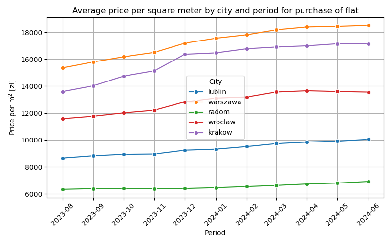

# Analysis of price of apartment for polish cities and ML-model training

## Overview

The goal of the project is to analyse factors contribution on price of the rent, and purchase of apartment for Warsaw, Wrocław, Lublin, Radom, and Łódz. The data were used to training machine learning model, which predicts value of rent in Wrocław, in dependency on such factors like: distance from center, area, year of the builing, bulining type, material of buliding, flor number, total number of floors, number of rooms, and avability of parking space, balcony, storage room, elevator, or security.

### Analysis of

- Price and distance to center distribution for selected cities
- Dependence of price and presence parking space, balcony, storage room, elevator, or security.
- Statistical analysis for these binary features (Mann-Whteney U, T-test, Kolmogorov-Smirnov Test, Cliff's Delta).
- Average price for rent and purchase of apartment between August 2023 and June 2024 for selected cities.
- Machine Learning models, and their parameters.
- Machine Learning models' accuracy and efficiency (training and fitting time measurement, MAE, $R^2$, cross validation, and RMSE calculations)
- ML-based price prediction app for Wrocław

## Project Structure

bash
```

├─data/               # Datasets (original, intermediate, cleaned)
├─ML_models/          # Machine Learning models for Linear Reggresion, Random Forest, and Extreme Gradient Boosting (XGB)
│
├─plots/              # Plots and charts for price and distance distribution, average price for rent or purchase for each city over time, and features importance for ML
│   │
│   └─data_two_sides/ # Plots of comparison for binary features distribution
│
├─reports/            # Statistical analysis for binary features, its easy to compare equlivalent table, and machine learning models comparison of efficiency and accuracy.
│
└─scripts/
        1_data_overview.ipynb                    # Data overview: city with the largest number of records, cities spectrum
        2_data_cleaning.ipynb                    # Pre-data cleaning, summary statistics of datasets
        3_data_analysis_statistics_intro.ipynb   # Pre-statiscics for binary features, price distribution for aparments rent and purchase in dependency of avalibilty of elevator
        4_statistical_analysis.ipynb             # Statistical analysis of binary features, analysis of their correlation witch price. Selection of feature with the higest correlation, and generation of plots of distribution.
        5_average_price_vs_time.ipynb            # Analysis of average price for rent and purchase of apartment over time.
        6_centre_distance.ipynb                  # Analysis of price and distance distrubution for selected cities.
        7_ML_testing_wroclaw.ipynb               # Features selection for ML models, evaluation models parameters, and comparison ML models.
        8_best_ML_model_selection.ipynb          # Comparison of accuracy, and efficiency of ML models.
        9_price_prediction.ipynb                 # ML model pipeline generation for Wrocław rent price prediction.
        10_app.py                                # Script to predict price of rent in Wrocław by browser survey.
        my.py                                    # Functions.
```

# Data Description

Source: https://www.kaggle.com/datasets/krzysztofjamroz/apartment-prices-in-poland

Features: city, area of flat, type of builiding, builidning material, age of buliding, ownership, condition, poi, number of rooms, floor, total number of floors in buliding, latitude, longitude distance to: center, universty, kindergarden, pharmacy, clinic, post office or restaurant, avaliability of parking space, balcony, storageroom, security and elevator.

Period: from August 2023 to June 2024.

# Methodology

1. Data cleaning:
- NaN in hasStorageRoom, hasSecurity, has Elevator, hasBalcony, and hasParkingSpace the NaN filled with "No".
- NaN in distances filled with centereDistance.
- NaN in condition filled with "Low".
- NaN in floor filled with FloorCount.
- NaN in floorCount is filled with 6.
- NaN in bulidYear filled with random number from 1850 to 1930.
- NaN in type filled with "NoType".
- NaN in buidingMaterial filled with "concreteSlab".
2. Joining all subset for rent and purchase into one dataset.
3. Exploration of statistial methods (Mann-Whteney U, T-test, Kolmogorov-Smirnov Test, Cliff's Delta).
4. Comparison of distribution of price, and distance to center for each city, and among them.
5. Testing ML models.
6. Evaluation of time and accuraty of prediction for ML models.
7. Pipeline performance for Wrocław, and selected features for app use.

# Key Findings

## Statistial analysis

The comparison of statistal indicators using t-test, Mann–Whitney, Kolmogorov–Smirnov (KS), amd Cliff's Delta methods for the presence and absence of amenities such as elevator, security, storage room, balcony, and parking space, allows us to assess the impact of these features on rental price differences.

- The Mann–Whitney U test compares the relative magnitude of values between two groups.
- The t-test compares the means of distributions, assuming normality.
- KS method test evaluates wheter the overall distributions differ.
- Cliff's Delta quantifies the effect size, measuring the degree of separation between groups.

### Rent
While all features yield statisically significant p-values across tests, only the presence of an elevator shows a standout correlation with a practically meaning effect size. This indicates that, among the amentities tested, the elevator is the only one with a clear and measurable impact on rental pricing.

### Purchase
All amenities show statistically significant differences in purchase prices between presence and absence group, but only presence of security, storage room, parking space, and elevator exhibit small but parctically relevant effect sizes, what suggest these amentites contribute to rent valuation, which securinty have the most pronouced impact.


## Average price over time
Average price of square meter for Warszawa, Lublin, Radom, Wrocław, and Kraków from September 2023 to June 2024
### Rent

Average rental prices range from appriximately 40 zł to 85 zł per square meter. Warsaw commands the highest rental rates, while Wrocław and Kraków follow with comparably similar prices. Radom remains the most affordable city for renters. Notably, Warsaw has shown a downward trend in rental prices.

### Purchase

Purchase prices range from around 6,000 zł to over 18,000 zł per square meter. The highest property pries are consistenly found in Warsaw, followed by Kraków, Wroclaw, Lublin, and Radom. Across all cities, a steady upward trend in purchase prices has been observed over time.



## Machine learning model accuracy and performance
[text](reports/ML_models_comparison.csv)

### Speed
- Linear Regression is by far the fastest model:

    - Prediciton time is  app. 3 times shorter thant XGBoost and app. 10 times shorter than Random Forest.
    - Training time: <0.001 sec
- Random Forest is the slowst in both trainng and prediction:

    - Training time: app. 3.4 sec.
- XGBoost is somewhere in the middle:
    - Training time: app.0.2 sec

### Prediction Accuracy

- Coeffictient of Determination $R^2$:

    - Linear Regression: $R^2$ = 0.68 
    - XGBoost and Random Forsest: $R^2$ = 0.91

- Error Metrics:

    - RMSE and MAE for Linear Regression are 1.5 times higher than for XGBoost and Random Forest, indicating significantly worse predicive accuracy.

XGBoost demostrated the most balanced performance, offering a strong compromise between computational efficiency and predictive accuracy. While not the fostest model, it significantly outperforms Linear Regression in terms of accuracy, and trains markedly faster than Random Forest, making it a highly effective and scalable choice for practical applications.

## Clone the repo

git clone https://github.com/your-username/your-repo.git
cd your-repo

# Install dependencies
pip install -r requirements.txt

# Run notebooks
jupyter notebook notebooks/eda_modeling.ipynb

# Future Work

- Obtaing data from advertising pages for 3 other cities for time of the year

- Data analysis of price changes over time, and distance to center

# Contact
