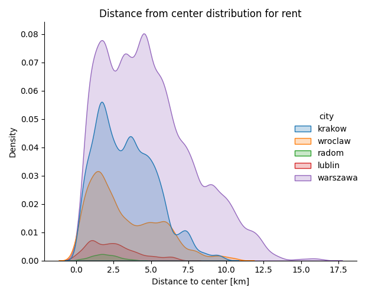
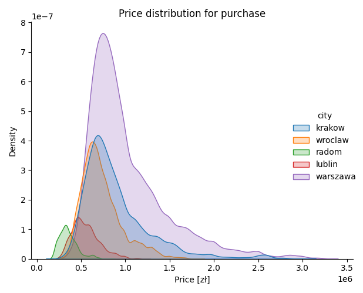
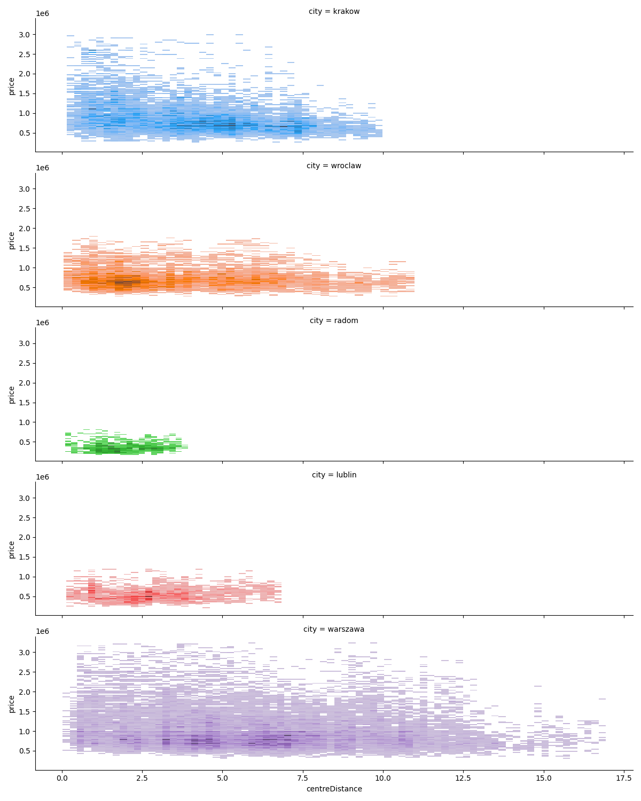

# Analysis of price of apartment for polish cities and ML-model training

## Overview

The goal of the project is to analyze factors contribution on price of the rent, and purchase of apartment for Warsaw, Wrocław, Lublin, Radom, and Łódz. The data were used to training machine learning model, which predicts value of rent in Wrocław, in dependency on such factors like: distance from center, area, year of the building, building type, material of building, flor number, total number of floors, number of rooms, and availability of parking space, balcony, storage room, elevator, or security.

### Analysis of

- Price and distance to center distribution for selected cities
- Dependence of price and presence parking space, balcony, storage room, elevator, or security.
- Statistical analysis for these binary features (Mann-Whitney U, T-test, Kolmogorov-Smirnov Test, Cliff's Delta).
- Average price for rent and purchase of apartment between August 2023 and June 2024 for selected cities.
- Machine Learning models, and their parameters.
- Machine Learning models' accuracy and efficiency (training and fitting time measurement, MAE, $R^2$, cross validation, and RMSE calculations)
- ML-based price prediction app for Wrocław

## Project Structure

bash

+
```

├─data/               # Datasets (original, intermediate, cleaned)
├─ML_models/          # Machine Learning models for Linear Regression, Random Forest, and Extreme Gradient Boosting (XGB)
│
├─plots/              # Plots and charts for price and distance distribution, average price for rent or purchase for each city over time, and features importance for ML
│   │
│   └─data_two_sides/ # Plots of comparison for binary features distribution
│
├─reports/            # Statistical analysis for binary features, its easy to compare equivalent table, and machine learning models comparison of efficiency and accuracy.
│
└─scripts/
        1_data_overview.ipynb                    # Data overview: city with the largest number of records, cities spectrum
        2_data_cleaning.ipynb                    # Pre-data cleaning, summary statistics of datasets
        3_data_analysis_statistics_intro.ipynb   # Pre-statistics for binary features, price distribution for apartments rent and purchase in dependency of availability of elevator
        4_statistical_analysis.ipynb             # Statistical analysis of binary features, analysis of their correlation witch price. Selection of feature with the higest correlation, and generation of plots of distribution.
        5_average_price_vs_time.ipynb            # Analysis of average price for rent and purchase of apartment over time.
        6_centre_distance.ipynb                  # Analysis of price and distance distribution for selected cities.
        7_ML_testing_wroclaw.ipynb               # Features selection for ML models, evaluation models parameters, and comparison ML models.
        8_best_ML_model_selection.ipynb          # Comparison of accuracy, and efficiency of ML models.
        9_price_prediction.ipynb                 # ML model pipeline generation for Wrocław rent price prediction.
        10_app.py                                # Script to predict price of rent in Wrocław by browser survey.
        my.py                                    # Functions.
```

## Data Description

Source: <https://www.kaggle.com/datasets/krzysztofjamroz/apartment-prices-in-poland>

Features: city, area of flat, type of building, building material, age of building, ownership, condition, poi, number of rooms, floor, total number of floors in building, latitude, longitude distance to: center, university, kindergarten, pharmacy, clinic, post office or restaurant, availability of parking space, balcony, storage room, security and elevator.

Period: from August 2023 to June 2024.

## Methodology

1. Data cleaning:
    - NaN in hasStorageRoom, hasSecurity, has Elevator, hasBalcony, and hasParkingSpace the NaN filled with "No".
    - NaN in distances filled with centerDistance.
    - NaN in condition filled with "Low".
    - NaN in floor filled with FloorCount.
    - NaN in floorCount is filled with 6.
    - NaN in buildYear filled with random number from 1850 to 1930.
    - NaN in type filled with "NoType".
    - NaN in buildingMaterial filled with "concreteSlab".
2. Joining all subset for rent and purchase into one dataset.
3. Exploration of statistical methods (Mann-Whitney U, T-test, Kolmogorov-Smirnov Test, Cliff's Delta).
4. Comparison of distribution of price, and distance to center for each city, and among them.
5. Testing ML models.
6. Evaluation of time and accuracy of prediction for ML models.
7. Pipeline performance for Wrocław, and selected features for app use.

## Key Findings

### Statistical analysis

The comparison of statistic indicators using t-test, Mann–Whitney, Kolmogorov–Smirnov (KS), amd Cliff's Delta methods for the presence and absence of amenities such as elevator, security, storage room, balcony, and parking space, allows us to assess the impact of these features on rental price differences.

- The Mann–Whitney U test compares the relative magnitude of values between two groups.
- The t-test compares the means of distributions, assuming normality.
- KS method test evaluates whether the overall distributions differ.
- Cliff's Delta quantifies the effect size, measuring the degree of separation between groups.

#### Rent

While all features yield statistically significant p-values across tests, only the presence of an elevator shows a standout correlation with a practically meaning effect size. This indicates that, among the amenities tested, the elevator is the only one with a clear and measurable impact on rental pricing.

#### Purchase

All amenities show statistically significant differences in purchase prices between presence and absence group, but only presence of security, storage room, parking space, and elevator exhibit small but practically relevant effect sizes, what suggest these amenities contribute to rent valuation, which security have the most pronounced impact.

### Average price over time

Average price of square meter for Warszawa, Lublin, Radom, Wrocław, and Kraków from September 2023 to June 2024

#### Rent

Average rental prices range from approximately 40 zł to 85 zł per square meter. Warsaw commands the highest rental rates, while Wrocław and Kraków follow with comparably similar prices. Radom remains the most affordable city for renters. Notably, Warsaw has shown a downward trend in rental prices.

#### Purchase

Purchase prices range from around 6,000 zł to over 18,000 zł per square meter. The highest property pries are consistency found in Warsaw, followed by Kraków, Wroclaw, Lublin, and Radom. Across all cities, a steady upward trend in purchase prices has been observed over time.


### Price and distance distribution

During the analysis, there were analyzed distribution of price [zł], and distance to center [km] separately, and price and distance together.

#### Rent Distance



 For almost all cities is observed significant peak in distance between 2 km to 2,5 km to center. The peaks' left skewness is determined by city magnitude - peaks for larger cities are shifted to left. Next significant peaks are observed for all cities, except Radom, in distance from 4,5 km to 5 km to center. For Krakow and Warszawa observed is also peak in range of value around 9 km and 1 km, where for Krakow these peaks are shifted to left by app. 1 km.

#### Purchase Distance

For Purchase, Distance distribution indicates more peaks for each city. For all cities is observed peak in distance between 1 km to 2 km to city center. Similar to Rent Distance Distribution, characteristic peaks for distance app. 4,5 km, 7 km, and 11 km (for Warszawa) are shifted to left in dependence of city size.

These multiple peaks suggest diverse subcenters or well-developed zones at various distances.

#### Rent Price

For all cities Rent Price Distribution has one significant peak between values 2 000 zł to 4 000 zł. The Price Distribution for Krakow is gently shiffted to left. Its suggest that, in Karkow there is more probable to find apartment for rent in lower price.

#### Purchase Price



For all cities, the distribution of price of the purchase exhibit a single significant peak, and is left skewed. In Radom peak occurs above 250 000 zł. In Lublin is centered above 500 000 zł. For Wrocław and Krakow, the peaks fall within the 650 000- 600 000 zł range. In Warszawa the peak is observed for above 700 000 zł, reflecting its position as the most expensive market among the analyzed cities.

#### Price vs Distance for Rent

The distribution allows to indicate the most common correlation between price and distance to center. The spectrum of results is highly related to area of the city.
In Krakow, the dominant cluster is within the 2 500-4 500 zł  price range and 1.5-5km from the center.
In Wrocław, the concentration lies in the 2 000-4 500 zł rage, primarily within 0.5-3km.  
In Warszawa, the prevailing range is 4 000-5 000 zł, with distances mainly between 0.5-6km.

The price vs distance to center distribution suggests that larger cities not only command higher prices, but also exhibit a broader spatial distribution of high-value transactions.

#### Price vs Distance for Purchase

For property purchases, the relationship price and distance to city center displays more distinct and city-specific patterns. 
In Karkow, the dominant cluster appears between 2.5-5.5 km, with prices ranging from 650 000-900 000zł.
In Wrocław, the distribution is more spatially condensed, centered around 2.0-2.5 km, with prices between 600 000 and 700 000 zł.
In Lublin, the peak concentration is tightly focused with 2.5-6 km, at prices between 600 000 and 650 000 zł.
In Warszawa, the dominant range extends from 3.0 to 7.0 km, with purchase prices between 600 000 and 1 000 000 zł.



### Machine learning model accuracy and performance

[ML Models Comparison Report](reports/ML_models_comparison.csv)

#### Speed

- Linear Regression is by far the fastest model:

  - Prediction time is  app. 3 times shorter thant XGBoost and app. 10 times shorter than Random Forest.
  - Training time: <0.001 sec
- Random Forest is the slowest in both training and prediction:

  - Training time: app. 3.4 sec.
- XGBoost is somewhere in the middle:
  - Training time: app.0.2 sec

#### Prediction Accuracy

- Coefficient of Determination $R^2$:

  - Linear Regression: $R^2$ = 0.68
  - XGBoost and Random Forest: $R^2$ = 0.91

- Error Metrics:

  - RMSE and MAE for Linear Regression are 1.5 times higher than for XGBoost and Random Forest, indicating significantly worse predictive accuracy.

XGBoost demonstrated the most balanced performance, offering a strong compromise between computational efficiency and predictive accuracy. While not the forest model, it significantly outperforms Linear Regression in terms of accuracy, and trains markedly faster than Random Forest, making it a highly effective and scalable choice for practical applications.

## Clone the repo

git clone <https://github.com/oktawiuszr/apartment_prices.git>
cd your-repo

## Install dependencies

pip install -r requirements.txt

## Future Work

- Obtain data from advertising pages for 3 other cities for time of the year

- Sub-corelation factors (distance/city area, price/area of flat)

- Corelation amenities, and building types with building age.

- Data analysis of price changes over time, and distance to center

## Contact

